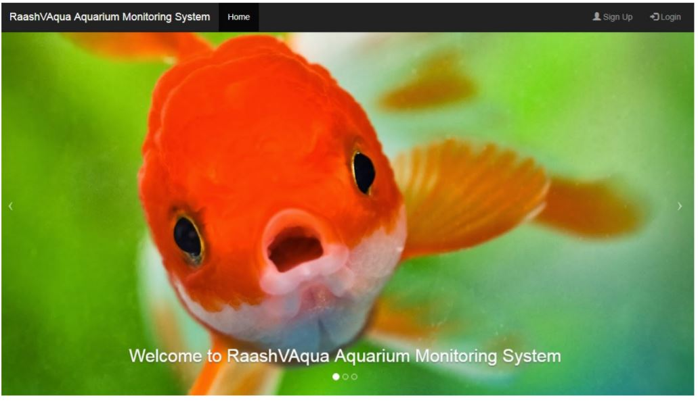
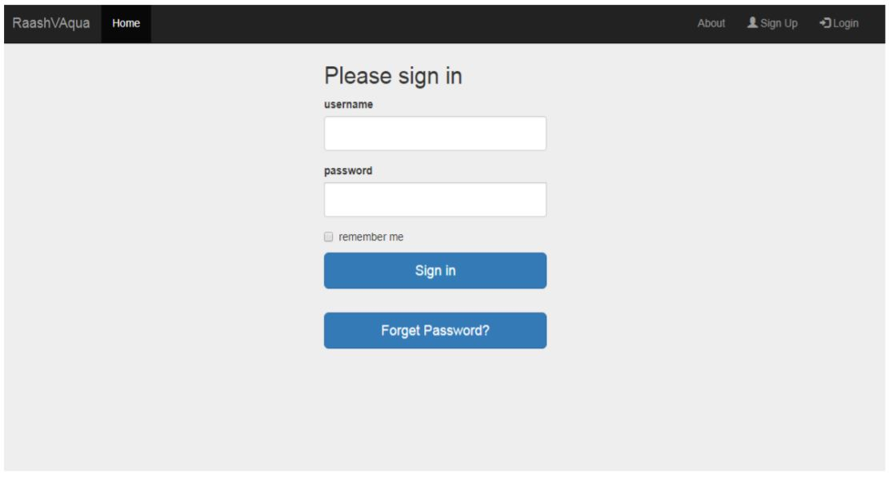
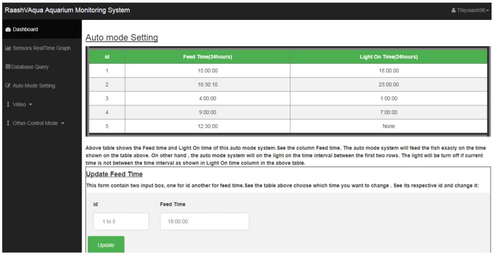
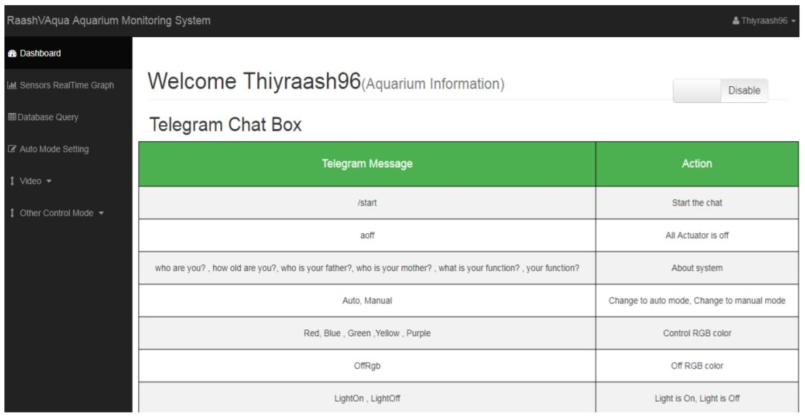

# Final-Year-Project

I have build an Aquarium Monitoring System using Python based Flask web framework for my server back end, Raspberry Pi as the system central controller together with few sensors such as Turbidity sensor(Water cloudiness), Ultrasonic sensor(For waterlevel)
,water temperature sensor, water leaking sensor. Besides that water pump, water filter, light and feeder using stepper motor are also used in this system.
Three control mode available for this system, one using Web,another Telegram based chatbot and lastly using Voice command (Snowboy).
Below shows the Hardware part of my system

## Website

This website is build based on Flask web framework as back end , MySQL as the database, and HTML, CSS and Javascript for the front end.

### Demo of website

## Telegram Chatbot

I host a custom Telegram bot in my Pi under my name “Thiyraash ” and I able to
communicate with my Pi by sending them messages and commands. The message that I send to
my Pi’s bot using my Telegram smartphone application will first go to the Telegram Server then
to the Telegram bot hosted in my Pi. The Pi will interpret the message and do the appropriate
action based on the message

### Demo of Telegram chatbot

