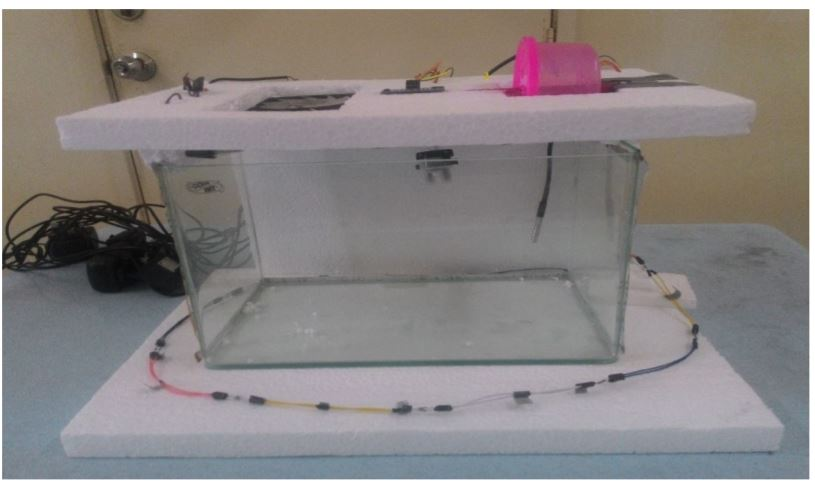
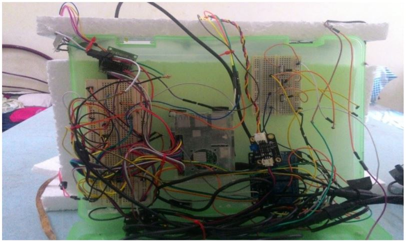
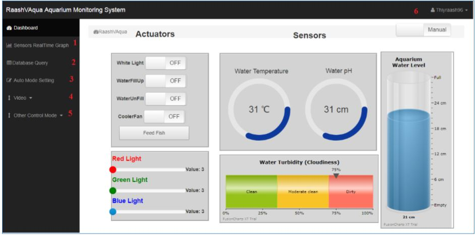
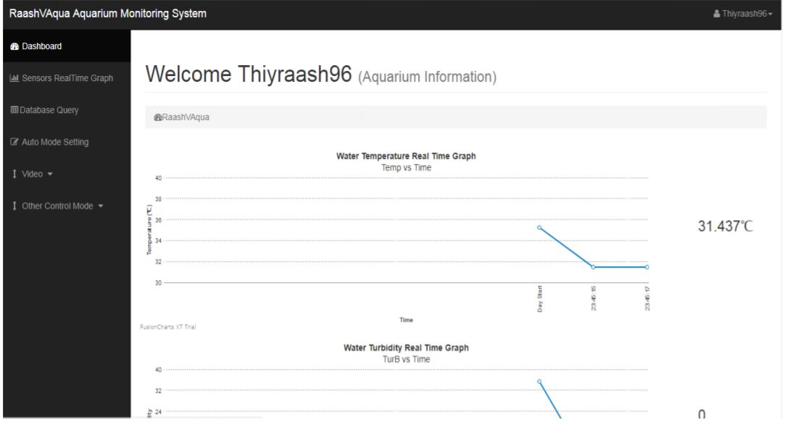
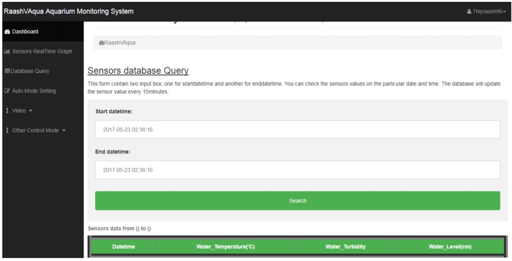
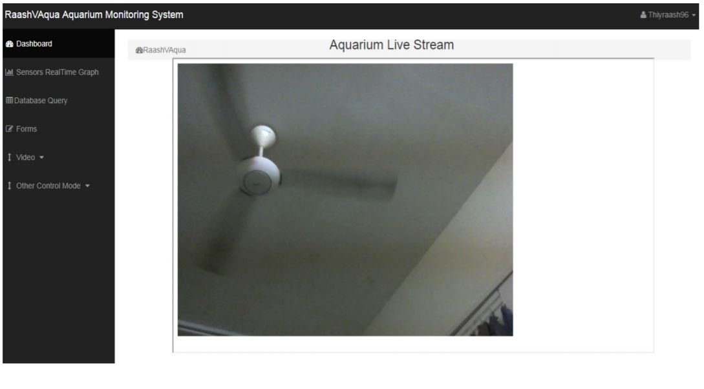
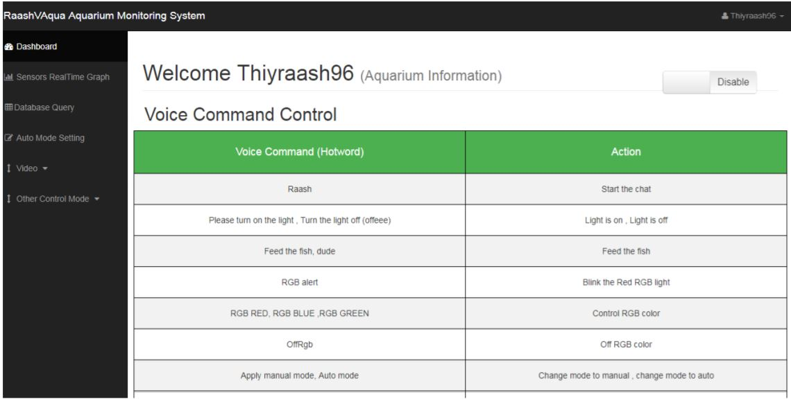

# Final-Year-Project

I have build an Aquarium Monitoring System using Python based Flask web framework for my server back end, Raspberry Pi as the system central controller together with few sensors such as Turbidity sensor(Water cloudiness), Ultrasonic sensor(For waterlevel) , water temperature sensor, water leaking sensor. Besides that water pump and, water filter, light and feeder using stepper motor are also used in this system.
Three control mode available for this system, one using Web,another Telegram based chatbot and lastly using Voice command (Snowboy).
Below shows the Hardware part of my system

Front view

Back view

## Website

This website is build based on Flask web framework as back end , MySQL as the database, and HTML, CSS and Javascript for the front end.

